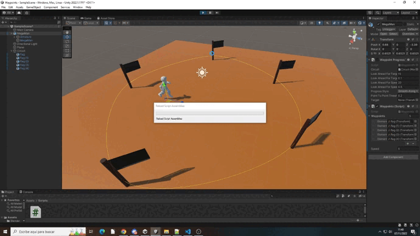

# Waypoints
## Autor: Álvaro González Rodríguez
alu0101202556

## GIF de la ejecución

1. Puedes importar el asset u obtenerlo en la asset store.
2. Utiliza un personaje que realice el recorrido por un circuito que generes.
3. Para el documento que debes subir a github, crear un gif animado con el recorrido renderizando los puntos del circuito.

Se ha creado un script propio para el recorrido de waypoints. Este tiene como variables públicas un vector de waypoints y la velocidad del personaje y como privada el índice del siguiente waypoint a ir

En el Start el personaje se ubica en el primer waypoint

En el Update el personaje se moverá hacia el siguiente waypoint, si lo alcanza se actualiza el índice para que se vaya al siguiente waypoint y si este ya ha sobrepasado los elementos del vector, el índice se iguala a 0 para volver a empezar el recorrido
